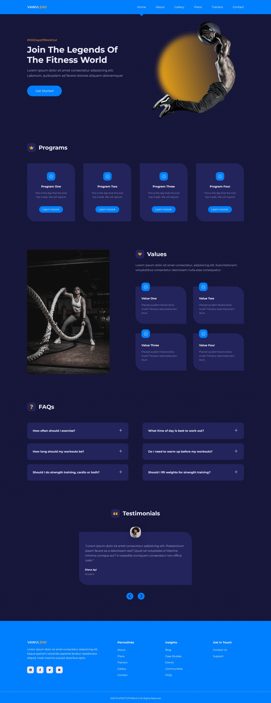
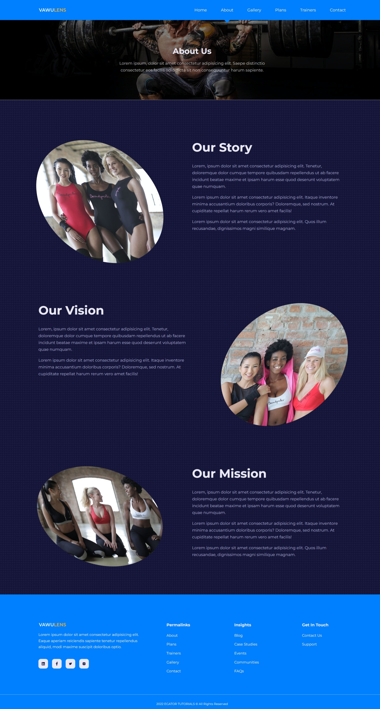
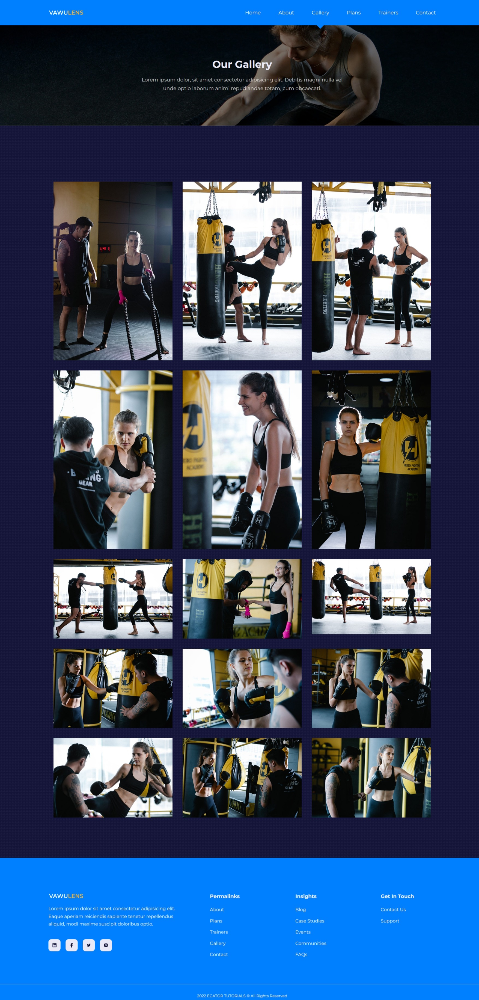
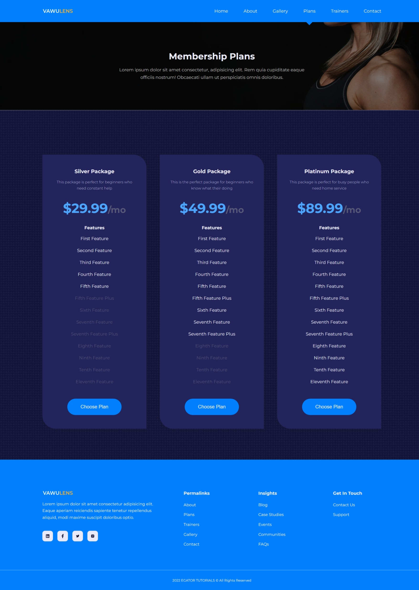
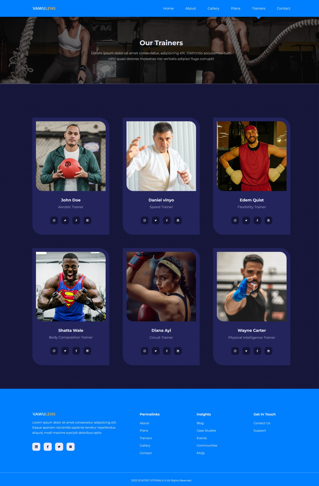
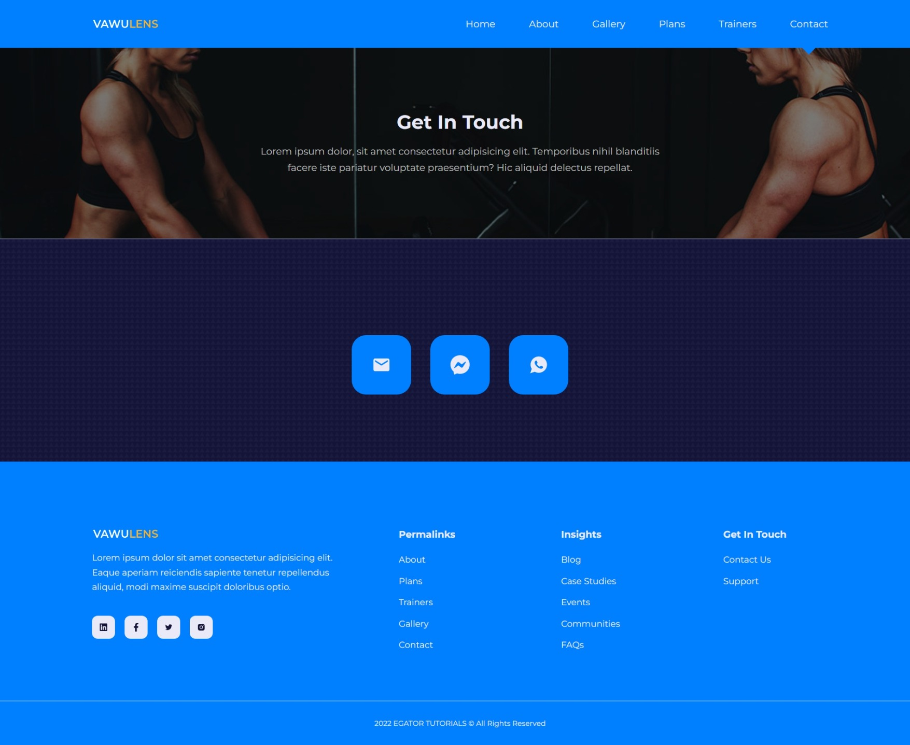

# Responsive React Js 18 & React Router 6 Project
This design is inspired by this [video](https://youtu.be/FiWby-T0Ec0), which belongs to [EGATOR](https://www.youtube.com/@EGATORTUTORIALS).

## Technologies
This web page was made with the following technologies:
- HTML5
- CSS3
- JavaScript
- React
- React DOM
- React Icons
- React Router DOM

## Pages
This project contains 7 pages: **Home**, **About**, **Gallery**, **Plans**, **Trainers** and **Contact**.

### Home
#### On this page, you will find various sections, such as the main section, the programs section, the values section, FAQs, testimonials, and finally, the footer section.

### About
#### On this page, you will find several sections, such as the main section where you will see the page title and a brief description, and in the following section, you will find the story, mission, and vision. Finally, there is the footer section.

### Gallery
#### On this page, you will see several sections, such as the main section where you will find the page title and a brief description, and in the next section, you will see a gallery of images. Finally, there is the footer section.

### Plans
#### On this page, you will see several sections, such as the main section where you will find the page title and a brief description. In the following section, you will find the different plans with their prices and what they include. Finally, there is the footer section.

### Trainers
#### On this page, you will find several sections, such as the main section where you will see the page title and a brief description. In the following section, you will see the different trainers and their social media links. Finally, there is the footer section.

### Contact
#### On this page, you will find several sections, such as the main section where you will see the page title and a brief description. In the next section, you will find the ways you can contact us. Finally, there is the footer section.

